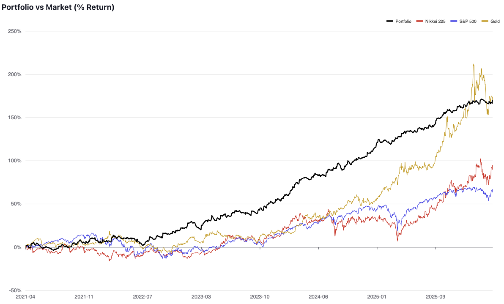

<p align="center">
  
</p>

<h1 align="center">Horizon5</h1>

<p align="center">
  A portfolio-oriented algorithmic trading framework for MetaTrader 5.<br/>
  Build, backtest, orchestrate, and operate multiple trading strategies from a single Expert Advisor.
</p>

<p align="center">
  
  
  
</p>

---

## Built with Horizon5 — live portfolio case study

Horizon5 is the framework I built to run my own multi-asset trading portfolio. The chart below is real out-of-sample performance of that portfolio against its benchmarks — produced by strategies implemented on top of this very framework.

<p align="center">
  
</p>

**See the full performance report:** [Horizon5 portfolio report (PDF)](https://drive.google.com/file/d/11PaDyKSfkM5XJ_rWKQIaMqYABIsIcQRh/view?usp=sharing)

The strategies themselves are proprietary and not part of this repository — what you get here is the **production-grade infrastructure** that made the portfolio possible: event-driven orchestration, deterministic identity, crash-safe persistence, risk-adjusted sizing, and optional remote observability.

---

## What is Horizon5

Horizon5 is **not a strategy**. It is the infrastructure a strategy needs in order to be treated as a long-running, auditable production system:

- A hierarchical **EA → Asset → Strategy → Order** model with equal-weight capital allocation at every level.
- An **event-driven core** that turns MT5's single-threaded tick loop into deterministic timer and primed-bar events (minute / hour / day).
- A strict **order state machine** with crash-safe persistence and automatic recovery on restart.
- A **service-oriented runtime**: blocking I/O (file writes, HTTP, remote APIs) is pushed out of the EA thread via a DLL-backed message bus and dedicated MT5 service scripts.
- **Deterministic magic numbers and UUIDs**, so the same logical entity maps to the same identity across restarts, backtests, and external systems.
- **Local-first reporting** (order history, strategy snapshots, market snapshots, logs) plus **optional remote observability and orchestration**.

## Capabilities at a glance

| Capability                    | What it gives you                                                                                                                  |
| ----------------------------- | ---------------------------------------------------------------------------------------------------------------------------------- |
| Portfolio orchestration       | One EA handles many instruments and many strategies per instrument, each in an isolated scope with its own balance and statistics. |
| Risk-adjusted position sizing | Equity-at-risk sizing (static or compounded) driven by stop-loss distance, normalized against broker volume constraints.           |
| Order lifecycle               | `PENDING → OPEN → CLOSING → CLOSED` (with `CANCELLED` branches), retry budgets per transition, and market-closed queueing.         |
| Crash-safe persistence        | JSON-serialized order state, statistics, and strategy-defined key/value state — loaded back on init for seamless recovery.         |
| Async I/O via message bus     | A shared-memory DLL (`HorizonMessageBus`) routes file writes and remote calls to dedicated service scripts so the EA never blocks. |
| Service health supervision    | The EA monitors required services every minute; trading auto-pauses on outage and auto-resumes on recovery.                        |
| Deterministic identity        | DJB2-based magic numbers and UUID v5-style identifiers derived from stable seeds — no central registry, no drift across restarts.  |
| Local reporting               | Order-history, strategy-snapshot, market-snapshot, and log exports per asset for post-hoc analysis.                                |
| Optional remote orchestration | Plug-in integrations for remote order management, account monitoring, and live dashboards.                                         |
| Backtester-friendly           | The same code path runs in the MT5 Strategy Tester; persistence and message bus gracefully degrade when not in live mode.          |

## Architecture, at a glance

```text
+-------------------------------------------------------------+
|                       Horizon.mq5 (EA)                      |
|                                                             |
|   configs/Assets.mqh  ->  SEAsset[]                         |
|                             |                               |
|                             +-> SEStrategy[]                |
|                                     |                       |
|                                     +-> SEOrderBook         |
|                                             |               |
|                                             +-> EOrder[]    |
|                                                             |
|   Event loop (OnTimer + primed-bar detection)               |
|   Risk sizing (SELotSize)                                   |
|   Statistics (SEStatistics)                                 |
|   Persistence, reporting, remote integration                |
+--------------------------+----------------------------------+
                           |
                     MessageBus (DLL, shared memory)
                           |
   +-----------------------+-------------------------+
   |                       |                         |
+--v--------------+  +-----v-----------+   +---------v---------+
| HorizonPersist. |  | HorizonGateway  |   | HorizonMonitor    |
| (async file I/O)|  | (remote orders) |   | (observability)   |
+-----------------+  +-----------------+   +-------------------+
```

The EA runs in a single MT5 thread. Dedicated `.mq5` **services** run as independent MT5 service scripts and communicate with the EA exclusively through the message bus — there is no shared state and no blocking call between them.

## How orchestration works

1. The EA boots, validates magic numbers, allocates capital equally across enabled assets, then across each asset's active strategies.
2. A 1-second timer drives an orchestration loop that dispatches primed-bar events (`OnStartMinute`, `OnStartHour`, `OnStartDay`) and configurable tick intervals down the hierarchy.
3. Strategies generate signals, hand orders to their order book, and let the framework handle sizing, normalization, broker submission, retries, market-closed queueing, and recovery.
4. Broker-side trade transactions bubble back up through the EA, are routed to the owning strategy via magic number, and move orders through the state machine.
5. Every state change is serialized; in live trading the write goes through the persistence service, so disk I/O never blocks the trading thread.
6. If any required service goes down, trading pauses with a typed reason and resumes automatically when the service recovers.

## Who this is for

- Builders of **multi-strategy, multi-instrument** MT5 portfolios who have outgrown the "one EA per chart" workflow.
- Quant-leaning traders who want **deterministic identifiers, crash safety, and observability** baked in, not bolted on.
- Teams that want a **clean extension surface** — add a strategy, add an asset, add a helper, add a service — without touching the core.

## Documentation

The full framework reference lives under [`docs/`](docs/):

| Section                                  | What's inside                                                                   |
| ---------------------------------------- | ------------------------------------------------------------------------------- |
| [Getting Started](docs/getting-started/) | Requirements, installation, compilation, and the shape of the project           |
| [How-To Guides](docs/how-to/)            | Adding strategies and assets, risk configuration, live setup, custom indicators |
| [Reference](docs/reference/)             | Inputs, services, events, order states, naming rules, monitor wire contract     |
| [Explanation](docs/explanation/)         | Architecture, portfolio model, order lifecycle, service model, design rationale |

## Ecosystem

Horizon5 can run fully standalone. For teams that want the full operational surface — remote order management, centralized monitoring, and a live dashboard — there is a private ecosystem around the EA:

- **Horizon Gateway** — remote order management and event streaming.
- **Horizon Monitor** — centralized account, strategy, order, and log telemetry.
- **Horizon War Room** — dashboard that consumes the Monitor telemetry.

These components are **not part of the public repository**. If you want to run Horizon5 at full capacity with the full ecosystem enabled, reach out via my [GitHub profile](https://github.com/pedrocarvajal) to get access and onboarding.

## Project status

Horizon5 is in **unstable pre-release** (version `0.x`). Inputs, interfaces, and internals may change without notice. Version `1.0` will mark the first stable release.

## Disclaimer

This software is provided for educational and research purposes. Algorithmic trading involves substantial risk of financial loss. Past performance does not guarantee future results. The authors are not responsible for any trading losses incurred through the use of this software. Always test thoroughly in a demo environment before deploying to live markets.

## License

Licensed under the PolyForm Noncommercial License. See [LICENSE.md](LICENSE.md) for details.
